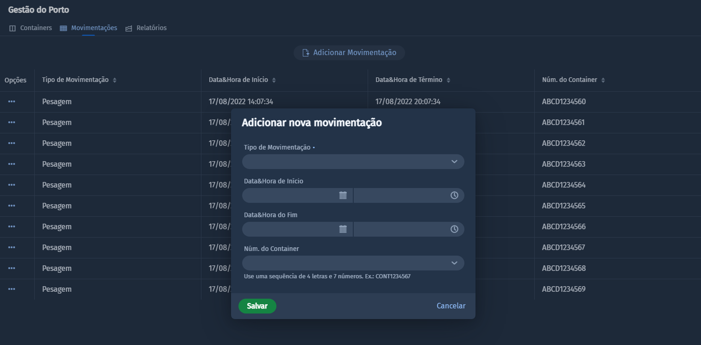

# Gestão do Porto

Este projeto tem como objetivo a criação de um CRUD simples para gerenciar
contêineres e suas movimentações de um porto utilizando o Spring para o Back-end e o 
Vaadin Flow para servir o front-end da aplicação.

> Você pode vizualizar a aplicação rodando em um container do serviço de applicativos da Azure [_clicando aqui_](https://gestaodoportoapp.azurewebsites.net)

## Captura de tela

## O Desafio
Construir uma aplicação web para gerir containers e movimentações de um porto
seguindo os seguintes requisitos funcionais:
- Crud de Contêiner
  - Cliente
  - Número do contêiner (4 letras e 7 número)
  - Tipo: 20/40
  - Status: Cheio / Vazio
  - Categoria: Importação / Exportação
- Crud de Movimentacões
  - Tipo de Movimentação (embarque, descarga, gate in, gate out, reposicionamento,
  pesagem, scanner)
  - Data e Hora do Início
  - Data e Hora do Fim
- Relatório com o total de movimentações agrupadas por cliente e tipo de movimentação.
  - No final do relatório deverá conter um sumário com total de importação / exportação.

## Tecnologias utilizadas
Foram usadas para construir essa aplicação os seguintes recursos:

- Spring
- JPA
- H2 Database (in memorian)
- Vaadin Flow (Front-end)

## Rodando a aplicação

Esse é um projeto padrão Maven. Para rodá-lo a partir do seu terminal,
digite `mvn` (Windows), ou `./mvn` (Mac & Linux), então abra 
http://localhost:8080 em seu navegador.

Você também pode importar o projeto em sua IDE como você faz com
qualquer projeto Maven.